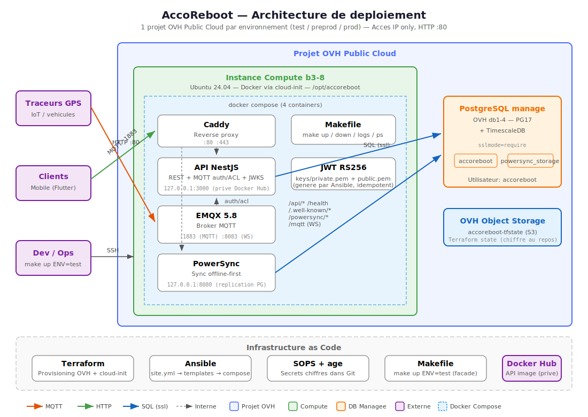

# AccoReboot Infrastructure

Infrastructure as Code pour AccoReboot : Terraform (provisioning OVH) + Ansible (configuration).

## Architecture



- **1 projet OVH Public Cloud par environnement** (test, preprod, prod)
- **Instance compute** (b3-8) : Caddy + Node.js + EMQX + PowerSync
- **PostgreSQL manage** (db1-4) : PG17 + TimescaleDB
- **Secrets** : SOPS + age (chiffres dans Git)
- **State Terraform** : remote S3 sur OVH Object Storage (1 bucket par projet OVH)

## Pre-requis

Installer les outils suivants :

```bash
# Terraform
brew install terraform    # ou https://developer.hashicorp.com/terraform/install

# Ansible
brew install ansible      # ou pip install ansible

# SOPS (gestion des secrets)
brew install sops         # ou https://github.com/getsops/sops/releases

# age (chiffrement pour SOPS)
brew install age          # ou https://github.com/FiloSottile/age/releases

# OpenStack CLI (stop/start instances)
pip install python-openstackclient
```

## Setup initial (premiere fois)

### 1. Generer ta cle age

```bash
mkdir -p ~/.config/sops/age
age-keygen -o ~/.config/sops/age/keys.txt
```

Note ta **cle publique** (`age1...`). Communique-la a l'equipe pour qu'elle soit ajoutee dans `.sops.yaml`.

### 2. Ajouter ta cle dans .sops.yaml

Editer `.sops.yaml` a la racine du repo et ajouter ta cle publique age :

```yaml
creation_rules:
  - path_regex: credentials/.*\.enc\.env$
    age: >-
      age1abc...(cesar),
      age1def...(autre-dev)
```

### 3. Creer les fichiers de credentials

```bash
# Copier les templates
cp credentials/common.enc.env.example credentials/common.enc.env
cp credentials/test.enc.env.example credentials/test.enc.env

# Editer avec tes vraies valeurs (ouvre dans $EDITOR, re-chiffre a la sauvegarde)
sops credentials/common.enc.env
sops credentials/test.enc.env
```

Pour trouver tes credentials :
- **Cles API OVH** : https://eu.api.ovh.com/createApp/
- **Project ID** : OVH Manager > Public Cloud > ton projet > Project ID
- **OpenStack user** : OVH Manager > Public Cloud > ton projet > Users & Roles
- **S3 credentials** : OVH Manager > Public Cloud > ton projet > Object Storage > S3 Users

### 4. Bootstrapper le bucket S3 (une seule fois par env)

Chaque projet OVH a son propre bucket S3 pour le state Terraform :

```bash
make bootstrap ENV=test       # Cree le bucket dans le projet OVH test
make bootstrap ENV=preprod    # Cree le bucket dans le projet OVH preprod
make bootstrap ENV=prod       # Cree le bucket dans le projet OVH prod
```

### 5. Deployer l'infra test

```bash
make up ENV=test         # init + apply + deploy (tout construire d'un coup)

# Ou etape par etape :
make init ENV=test
make plan ENV=test       # Verifier ce qui va etre cree
make apply ENV=test      # Creer les ressources (auto-approve)
```

## Utilisation quotidienne

```bash
# Voir toutes les commandes disponibles
make help

# Tout construire d'un coup
make up ENV=test

# Ou deployer / mettre a jour l'infra etape par etape
make plan ENV=test
make apply ENV=test      # auto-approve

# Deployer la config (Ansible)
make deploy ENV=test

# Stop / start d'une instance (sans la detruire)
make stop ENV=test
make start ENV=test

# SSH sur le serveur
make ssh ENV=test

# Editer les secrets
make sops-edit-common           # Credentials partages
make sops-edit-env ENV=test     # Credentials de l'env test
```

## Structure du repo

```
.
├── Makefile                         # Facade unique
├── .sops.yaml                       # Regles de chiffrement SOPS
│
├── credentials/                     # Secrets chiffres (commites dans Git)
│   ├── common.enc.env              # Cles API OVH + SSH + S3
│   ├── test.enc.env                # Credentials du projet OVH test
│   ├── preprod.enc.env             # Credentials du projet OVH preprod
│   └── prod.enc.env                # Credentials du projet OVH prod
│
├── scripts/
│   └── with-secrets.sh              # Dechiffre SOPS et execute une commande
│
├── terraform/
│   ├── bootstrap/                   # Bucket S3 pour les states
│   ├── modules/                     # compute, managed_db
│   └── environments/                # test, preprod, prod
│
├── ansible/
│   ├── inventory/                   # Genere par Terraform
│   ├── group_vars/                  # Variables par env
│   ├── roles/                       # Roles de configuration
│   └── playbooks/                   # Playbooks d'orchestration
│
└── docs/
    └── architecture.svg             # Schema d'architecture
```

## Ajouter un nouvel environnement

1. Creer un nouveau projet OVH Public Cloud
2. Creer un utilisateur OpenStack + S3 dans ce projet
3. Creer `credentials/<env>.enc.env` : `sops credentials/<env>.enc.env`
4. Copier `terraform/environments/test/` vers `terraform/environments/<env>/`
5. Adapter les variables (flavor, plan DB, region...)
6. `make bootstrap ENV=<env>` (cree le bucket S3 dans le nouveau projet)
7. `make up ENV=<env>` (init + apply + deploy)

## Ajouter un nouveau developpeur

1. Le dev genere sa cle age : `age-keygen -o ~/.config/sops/age/keys.txt`
2. Il communique sa cle publique `age1...`
3. Ajouter sa cle dans `.sops.yaml`
4. Re-chiffrer tous les fichiers avec la nouvelle cle :
   ```bash
   sops updatekeys credentials/common.enc.env
   sops updatekeys credentials/test.enc.env
   # etc.
   ```
5. Commit et push
